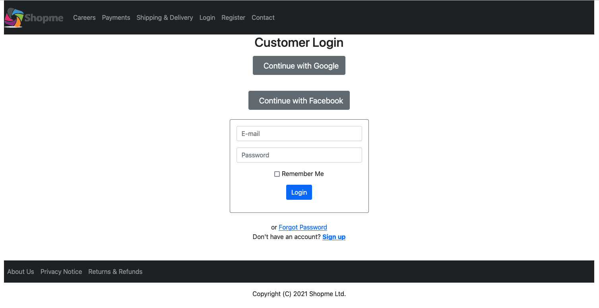
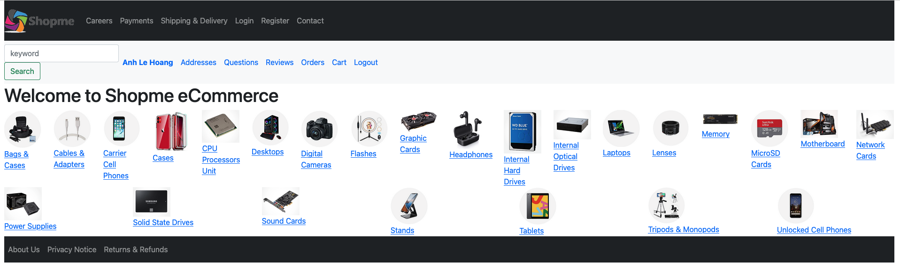
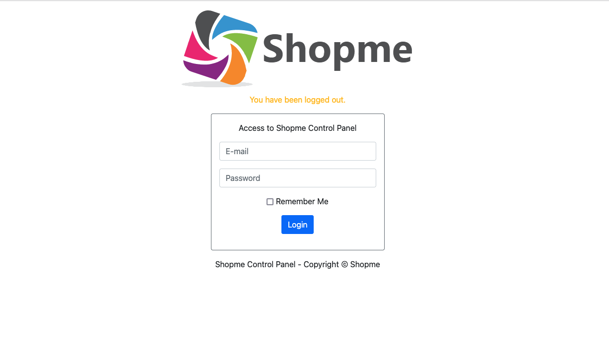
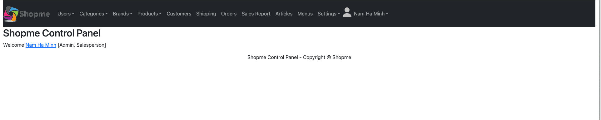

# $$\textcolor{red}{\text{UNDER CONSTRUCTION}}$$

## 1. Project Title:

"Shopme" - An E Commerce Application: A full-stack development experience in programming a real-life shopping web application using the latest technologies such as Java, Spring Boot, Hibernate, Thymeleaf, Bootstrap, jQuery, HTML, RESTful Webservices.

Shopme application has two main users: Administrator and Customers.

Administrator User Modules include: Users, Categories, Brands, Products, Customers, Shipping, Orders, Sales Report, Reviews, Questions, Settings.

Customer User Modules include: Categories listing, Product details, Search products, Shopping cart, Checkout, Manage orders, Tracking orders, Customer registration.

This application features deployment on Heroku cloud platform, with user's uploaded files stored on Amazon S3 server.

## 2. Tech Stack: 

- Spring framework development with Spring Boot

- Spring Data JPA and Hibernate framework

- Spring Security for authentication and authorization

- Spring OAuth for social login with Facebook and Google

- Spring Mail for sending customer registration confirmation and order confirmation

- PayPal Checkout API for capturing payment from customer

- Google Chart API for drawing charts of sales report

- JUnit, AssertJ and Mockito in unit testing

- Spring RESTful Webservices

- Bootstrap 4, HTML5 and jQuery 3

- Amazon S3 APIs

- Deployment on Heroku (AWS)
  

## 3. Customer Login (Screenshot)

## 4. Customer Landing Page (Screenshot)

## 5. Administrator Login (Screenshot)

## 6. Administrator Landing Page (Screenshot)

## 7. Adapted from: 

UDEMY: Java Spring Boot E-Commerce Ultimate Course

Created by: Nam Ha Minh

Last updated 08/2024

URL: https://www.udemy.com/course/spring-boot-e-commerce-ultimate/
